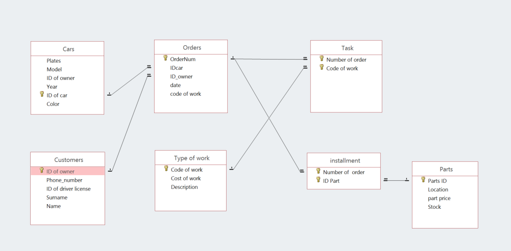
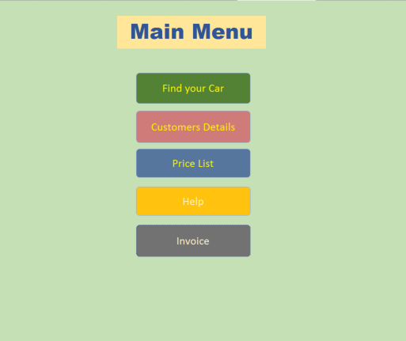
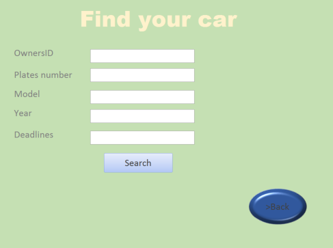
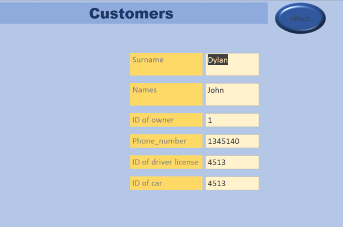
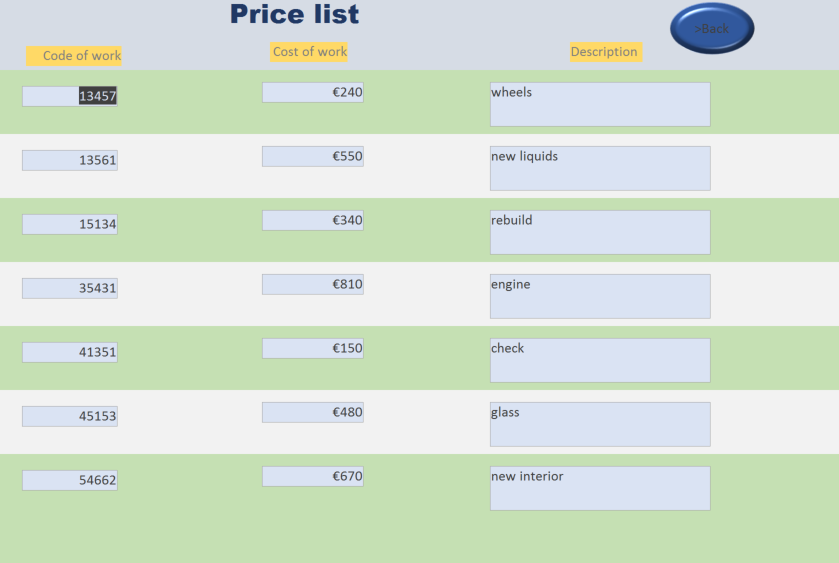
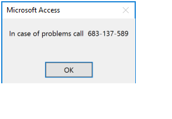
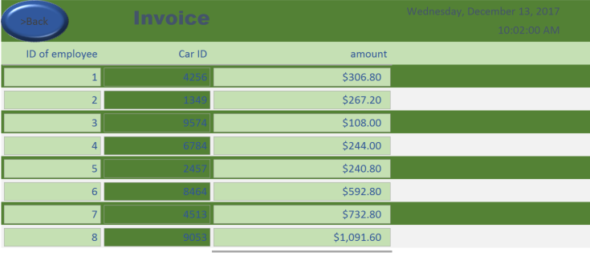

# Access-DataBase-Project
## Needs
Main goal of this database is to manage and organize work in workshop.

## Context
 Access to the database should be provided to the employees and customers. Application can be connected to the internet connection for easier use of customers.

## Functionalities
•	Show prices of work and parts 

•	Show Customers information

•	Show when work going to be done

•	You can find your car using the search

•	Show all cars and their information

•	Has menu where you can choose what you need

•	Show prices after tax and currency value 

•	Show invoice after work was done

### Entity Diagram

## User	Manual
### Main	Menu	
The main screen of the application. There are all functions of
The database. Top Button helps customers to find there car or get information when its going to be done. Under it red button, gives information about customers etc. Blue button shows prices for job and parts. Yellow one shows emergency phone number, and the grey one gives customer and invoice after work was done.	

### Find Your Car
in this form you can use the search to find your car, u can fill up at list one letter in field, and you will see the results. to go back to the main menu press the BACK button.

### Customers Details
Here you have list of all customers and there details, when you find the information you needed, just click BACK button to go back to main menu.

### Price List
In price list you can see all prices for work and parts, if you decided to do the work on your car just tell manager the code of work or its name, to go back from this form click BACK button. 

### Help
Help button brings up emergency number, if you have problems of any kind, please call us by this number.

### Invoice
After work on your car was done, you will get an invoice, where you can see who did the job on your car,  cost of parts and job, and overall price for work.

