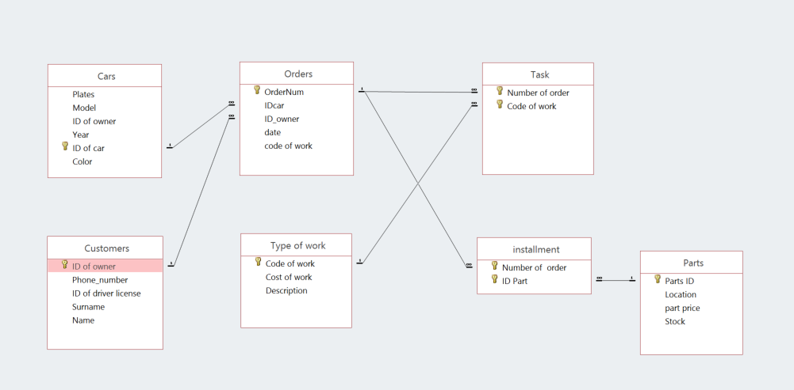

# Access-DataBase-Project
## Needs
Main goal of this database is to manage and organize work in workshop.

## Context
 Access to the database should be provided to the employees and customers. Application can be connected to the internet connection for easier use of customers.

## Functionalities
•	Show prices of work and parts 

•	Show Customers information

•	Show when work going to be done

•	You can find your car using the search

•	Show all cars and their information

•	Has menu where you can choose what you need

•	Show prices after tax and currency value 

•	Show invoice after work was done

### Entity Diagram

## User	Manual
